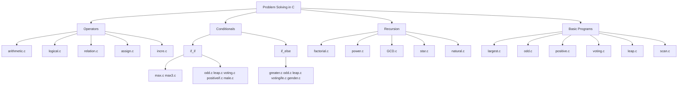
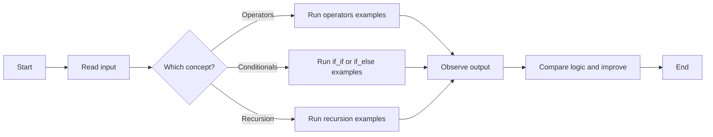

# Problem Solving using C

Welcome to my C practice repository. This project collects beginner friendly C programs that I wrote while learning core problem solving logic.

## Repository details to set on GitHub

**Description**
Short description of this repository

**Website**
https://syllabuscal.ranjansharma.info.np

**Topics**
`c` `problem-solving` `beginner-friendly` `conditional-statements` `operators` `recursion` `programming-fundamentals`

## What is inside

This repo focuses on small, focused programs for:

- if and if-else based decisions
- arithmetic, relational, logical, and assignment operators
- recursion based math problems
- ternary operator based checks

## Folder overview

| Folder | Focus |
|---|---|
| `/operators` | Arithmetic, logical, relational, assignment, increment/decrement examples |
| `/if_if` | Decision making with independent `if` statements |
| `/if_else` | Decision making with `if-else` branches |
| `/recursions` | Recursive solutions for factorial, power, GCD, product, and sum |
| `/` (root) | Basic starter programs like odd/even, leap year, positive/negative, voting |

## Program map



## Decision flow diagram (example path)



## Build and run

Use the existing Makefile from the repository root:

```bash
make clean
make
./main
```

## Notes

- This is a learning repository, so some files are experiments in progress.
- Program style may vary from file to file because examples were written while practicing different concepts.
- The live website linked above is the project website reference.
